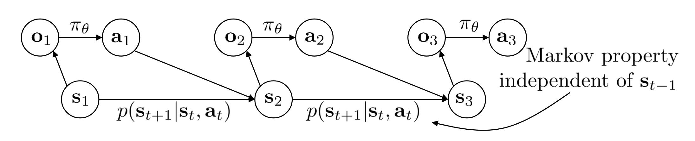
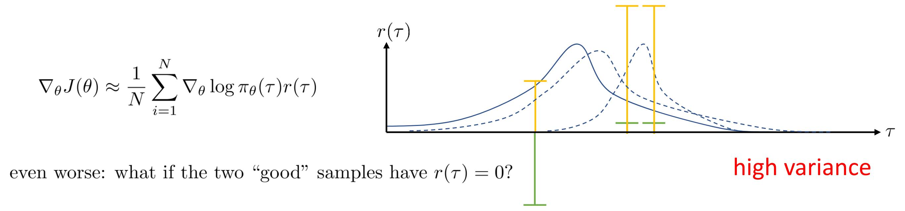

---
header-includes:
  - \usepackage[ruled,vlined,linesnumbered]{algorithm2e}
  - \hypersetup{colorlinks=true}
---

# Policy gradients

This is a set of notes to accompany the code in `vpg.py` - these essentially outline a set of variations on vanilla policy gradient (which is derived below) as well as explain why they are required (primarily, because the naive Monte Carlo estimator of the policy gradient has high variance).

## The reinforcement learning problem
A Markov decision process is given by the graphical model below.

The framework for reinforcement learning is a Markov decision process equipped with a scalar field $R: S\times A\rightarrow\mathbb{R}$. The goal is to select a policy model $\pi_\theta(a_t | o_t)$ which maximizes the reinforcement learning objective:

\begin{equation}
J(\theta) = \mathbb{E}_{\tau\sim\pi_\theta(\tau)}\big[ r(\tau) \big]
\end{equation}

where $\tau = (s_0, o_0, a_0, s_1..., s_T)$ is a sample trajectory (also called a trace). The intuition here is that this framework resembles the process of sequential decision making in a very general way. The reward function $r(\tau)$ is $r(\tau) = \sum_{t=0}^T r(a_t, s_t)$ and the distribution $\pi_\theta(\tau)$ for the entire graphical model is given by

\begin{equation}
\pi_\theta(\tau) = p(s_o)\prod_{t=1}^T\underbrace{\pi_\theta(a_t | o_t)}_{\text{policy}}~\underbrace{p(o_t | s_t)}_{\text{emission model}} ~\underbrace{p(s_{t+1} | s_t, a_t)}_{\text{dynamics}}
\end{equation}

The reinforcement learning objective is the expected reward accrued over a trajectory $\tau$ drawn from the graphical model distribution. Note that the agent may not know the exact dynamics (although modeling the dynamics is the purview of model-based RL) or the exact state $s_t$. The agent only recieves observations $o_t$ (which may alias the state) and must select an action according to a policy model $\pi_\theta(a_t | o_t)$. To get a good agent, the goal is to identify a policy from a class of policies parametrized by $\theta$ which maximizes the reinforcement learning objective. The reward function is assumed to be provided by the environment (or the programmer, in most cases).

## Vanilla policy gradient 

What's the naive thing to do? Let's take the gradient of the reinforcement learning objective.

\begin{equation}
\nabla_\theta J(\theta) = \nabla_\theta \int r(\tau)\pi_\theta(\tau) d\tau = \int r_\tau \nabla_\theta \pi_\theta(\tau) d\tau
\end{equation}

Using the following identity

\begin{equation}
\nabla_x \log f(x) = \frac{1}{f(x)} \nabla_x f(x)
\end{equation}

Produces the following expectation

\begin{equation}
\nabla_\theta J(\theta) = \mathbb{E}_{\tau\sim\pi_\theta(\tau)}\big[r(\tau)\nabla_\theta \log \pi_\theta(\tau) \big]
\end{equation}

which is really nice because we can estimate the expectation (which is the exact objective gradient with respect to the policy parameters $\theta$) by Monte Carlo sampling of trajectories (i.e. running the agent with the policy in the environment). First, let's simplify the objective gradient.

In $\pi_\theta(\tau)$, note that applying the $\log$ produces a sum

\begin{equation}
\log \pi_\theta(\tau) = \log p(s_0) + \sum_{t = 1}^T\big[\log \pi_\theta(a_t | o_t) + \log p(o_t | s_t) + \log p(s_{t+1} | a_t, s_t)\big]
\end{equation}

In the gradient $\nabla_\theta \pi_\theta(\tau)$, the only term which is dependent on $\theta$ is the policy $\pi_\theta(a_t | o_t)$. Fully expanding in the expectation, this produces

\begin{equation}
\nabla_\theta J(\theta) = \mathbb{E}_{\tau\sim\pi_\theta(\tau)}\big[\big(\sum_{t=0}^Tr(a_t, s_t)\big)\big(\sum_{t=0}^T \nabla_\theta \log \pi_\theta(a_t | o_t) \big)\big]
\end{equation}

and, taking Monte Carlo estimates, produces

\begin{equation}
\nabla_\theta J(\theta) \approx \frac{1}{N}\sum_{i=0}^N\big[\big(\sum_{t=0}^Tr(a_{t,i}, s_{t,i})\big)\big(\sum_{t=0}^T \nabla_\theta \log \pi_\theta(a_{t,i}| o_{t,i}) \big)\big]
\end{equation}

With the gradient in hand, we can use any gradient-based optimizer we want

\begin{equation}
\theta\rightarrow \theta + g(\nabla_\theta J(\theta))
\end{equation}

This set of computations produces the following algorithm (called _REINFORCE_ or _vanilla policy gradient_) for training up good policies

\begin{algorithm}[H]
\DontPrintSemicolon
\SetAlgoLined
\KwResult{A trained policy $\pi_\theta(a_t | o_t)$}
\SetKwInOut{Input}{Input}\SetKwInOut{Output}{Output}
\Input{MDP with a policy $\pi_\theta(a_t | o_t)$. \\ 
Number $k$ of training epochs. \\
Gradient optimizer (e.g. ADAM).
}
\BlankLine
\For{$e\leftarrow 1$ \KwTo $k$}{
\emph{Initialize trajectory buffer to store sample experience trajectories.}\\
\For{$i\leftarrow 1$ \KwTo $N$}{
\emph{Collect trajectory samples $\tau_i$ by sampling actions from current policy $\pi_\theta(a_t | o_t)$}
}
\emph{Compute the loss with the naive Monte Carlo estimate $\frac{1}{N}\sum_{i = 0}^N\log\pi_\theta(\tau_i)r(\tau_i)$ and backpropagate.}}
\caption{Vanilla policy gradient}
\end{algorithm} 

## Baselines 

The problem with this algorithm is the variance in the estimator. This is beautifully illustrated in the following set of slides by Sergey Levine, which I expand on with notes and calculations taken from [Peter and Schaal, 2008](https://www.ias.informatik.tu-darmstadt.de/uploads/Publications/Publications/Neural-Netw-2008-21-682_4867[0].pdf) and [Grahlwohl et al, 2018](https://arxiv.org/pdf/1711.00123.pdf).

Basically, what this plot illustrates is that if you adjust all the $r(\tau)$ by constant $r(\tau)\rightarrow r(\tau) + b$, this will adjust how the policy distribution is shifted by the gradient step. In particular, the loss tries to push the distribution up where the reward is high but if you choose a "naive" constant to add to the reward, then you'll mess up the distribution shift. The issue is the high variance in the estimator. This is easy to see by assuming that $r(a_t, s_t) = c$ for some constant $c$. The variance of the estimator grows cubically in $T$
\begin{equation}
Var_{\tau\sim\pi_\theta(\tau)}\big[r(\tau)\nabla_\theta\log\pi_\theta(\tau) \big] = c^2T^2\sum_{t = 0}^TVar\big[\nabla_\theta\log\pi_\theta(a_t | o_t)\big]
\end{equation}
Of course, if you choose $b = -c$ then the algorithm does the right thing - the expectation is $0$ and the variance is also $0$ which makes sense. If every state gives the same reward, then you shouldn't shift the distribution at all, you're already at an optimal policy.

The above example gives rise to an interesting proposal: let's reduce the variance by shifting by a smart $b$. We call such a smart $b$ a _baseline_. First, we will prove that the expectation is unaffected by the constant shift. Express the gradient with the inclusion of the constant $b$
\begin{align}
\nabla_\theta J(\theta) &= \nabla_\theta \int \pi_\theta(\tau)(r(\tau) + b) d\tau \\
                           &= \nabla_\theta \int \pi_\theta(\tau)r(\tau) d\tau + b \underbrace{\int \pi_\theta(\tau) d\tau}_{1} \\
                           &= \nabla_\theta \int \pi_\theta(\tau)r(\tau) d\tau
\end{align}
This proves that the expectation is unaffected

\begin{equation}
\nabla_\theta J(\theta) = \mathbb{E}_{\tau\sim\pi_\theta(\tau)}\big[r(\tau)\nabla_\theta \log \pi_\theta(\tau) \big] = \mathbb{E}_{\tau\sim\pi_\theta(\tau)}\big[(r(\tau) + b)\nabla_\theta \log \pi_\theta(\tau) \big]
\end{equation}

The variance, however, is affected. Let $q(\theta) = \nabla_\theta \log \pi_\theta(\tau)$. The variance is
\begin{align}
Var_{\tau\sim\pi_\theta(\tau)}\big[(r(\tau) + b)q(\theta)\big] &= \mathbb{E}_{\tau\sim\pi_\theta(\tau)}\big[(r(\tau) + b)^2q(\theta)^2 \big] - \mathbb{E}_{\tau\sim\pi_\theta(\tau)}\big[(r(\tau) + b)q(\theta)\big]^2 \\
&= \mathbb{E}_{\tau\sim\pi_\theta(\tau)}\big[(2br(\tau)+ b^2)q(\theta)^2\big]
\end{align}
and we can solve for the $b$ which minimizes the variance.
\begin{align}
\frac{d}{db} Var_{\tau\sim\pi_\theta(\tau)}\big[(r(\tau) + b)q(\theta)\big] &= \mathbb{E}_{\tau\sim\pi_\theta(\tau)}\big[(2r(\tau)+ 2b)q(\theta)^2\big] = 0 \\
&\implies \underbrace{b = \frac{-\mathbb{E}_{\tau\sim\pi_\theta(\tau)}\big[r(\tau)q(\theta)^2\big]}{\mathbb{E}_{\tau\sim\pi_\theta(\tau)}\big[q(\theta)^2\big]}}_{\text{optimal $b$}}
\end{align}

One thing to note here: the gradient is vectorial, so we really have a vector of expectations
\begin{equation}
\nabla_\theta J(\theta) = \begin{bmatrix} \mathbb{E}_{\tau\sim\pi_\theta(\tau)}\big[r(\tau)\nabla_{\theta_1}\log\pi_\theta(\tau)\big] \\ \mathbb{E}_{\tau\sim\pi_\theta(\tau)}\big[r(\tau)\nabla_{\theta_2}\log\pi_\theta(\tau)\big] \\ \vdots \end{bmatrix}
\end{equation}
and each component of this vector can have a different constant $b_i$. The optimal $b$ above is thus also vectorial. In practice, a popular, simple to implement selection for $b$ is
\begin{equation}
b = \frac{1}{N}\sum_{i = 0}^N r(\tau_i)
\end{equation}
which is the average reward over the all sampled trajectories. The intuition for this is simple - trajectories which have total reward greater than average should contribute to pushing the distribution up. Note that [Grahlwohl et al, 2018](https://arxiv.org/pdf/1711.00123.pdf) illustrates more advanced techniques for more general stochastic gradient estimators.

This introduces our first theme on vanilla policy gradient.

\begin{algorithm}[H]
\DontPrintSemicolon
\SetAlgoLined
\KwResult{A trained policy $\pi_\theta(a_t | o_t)$}
\SetKwInOut{Input}{Input}\SetKwInOut{Output}{Output}
\Input{MDP with a policy $\pi_\theta(a_t | o_t)$. \\ 
Number $k$ of training epochs. \\
Gradient optimizer (e.g. ADAM).
}
\BlankLine
\For{$e\leftarrow 1$ \KwTo $k$}{
\emph{Initialize trajectory buffer to store sample experience trajectories.}\\
\For{$i\leftarrow 1$ \KwTo $N$}{
\emph{Collect trajectory samples $\tau_i$ by sampling actions from current policy $\pi_\theta(a_t | o_t)$}
}
\emph{Compute the loss with the Monte Carlo estimate $\frac{1}{N}\sum_{i = 0}^N\log\pi_\theta(\tau_i)(r(\tau_i) - b)$ with $b = \sum_{i=0}^N r(\tau_i)$ and backpropagate.}}
\caption{Vanilla policy gradient with baselines}
\end{algorithm} 

## Rewards-to-go
